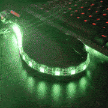

# AntiChoker

A tiny hardware project for [Festiwal Światła](https://festiwalswiatla.hs3.pl/) - a choker with a LED strip displaying air quality _(aka a choker showing when you are going to choke)_

## Hardware

- ESP32. [XIAO ESP32S3](https://www.seeedstudio.com/XIAO-ESP32S3-p-5627.html) was used, but any similar chip should work. Consider using a chip with integrated Stemma QT connector (like [Adafruit QT Py RP2040](https://www.adafruit.com/product/4900)) to avoid unnecessary soldering. Processes air quality and displays it on the LED strip (also sends over MQTT if needed)
- [Adafruit SGP40 Air Quality Sensor Breakout](https://www.adafruit.com/product/4829). Monitors air quality and gives it out in `[0-500]` range
- Any suitable LED strip (1 LED/cm is preferrable)
- An actual choker to attach the stip. This can potentially hold just on the led strip, but having a choker gives control over the length and a decent base
- Powered via powerbank, but possible to solder a battery (if 3V pin is used for LEDs)

### Connection

- Connect SGP40 to ESP32 via Stemma QT cable (SDA, SCL, GND, 3V)
- Connect LEDs to ESP32 (data pin, GND, 5V)

## Software

Built with PlatformIO and VSCode. Most logic are in `leds_controller.cpp`. Sensor fetching and LEDs update are done on separate cores, as sensor takes ~100-200ms to get the data, which is not suitable for smooth LED animation. It is also able to send measurtement data over MQTT ()

### Setup

- If you don't need MQTT - use `no_mqtt` env
- Set `DATA_PIN` in `leds_controller.cpp` (TODO: pass from env?)
- For MQTT use `production` env
  - Copy `secrets.ini.example` into `secrets.ini` and set appropriate values for WiFi and MQTT connections

### Visuals

Animation is basically:

- Air quality converted to color via color palette
- Color is set to the whole LED strip, with brightness adjusted as a moving sine-wave (with some gamma corrections)
